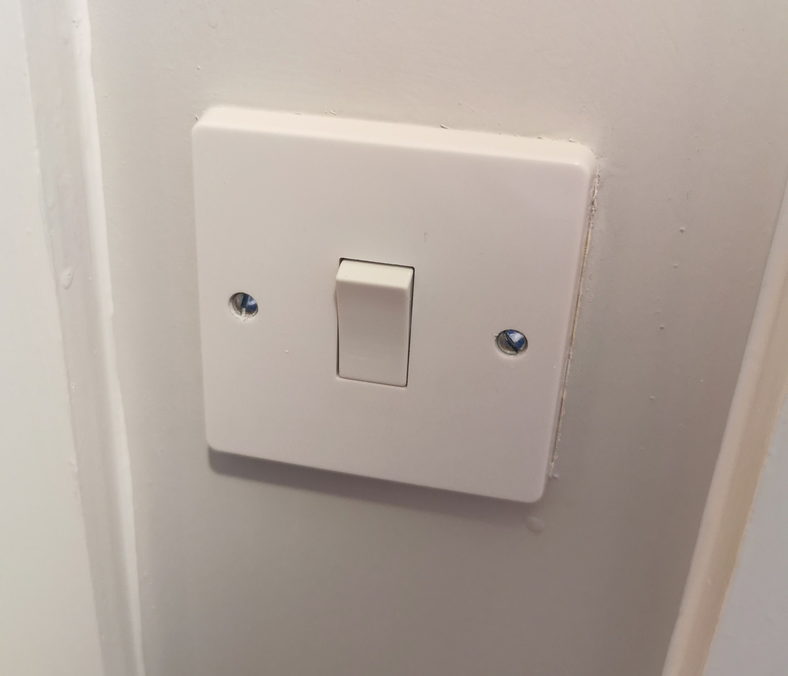
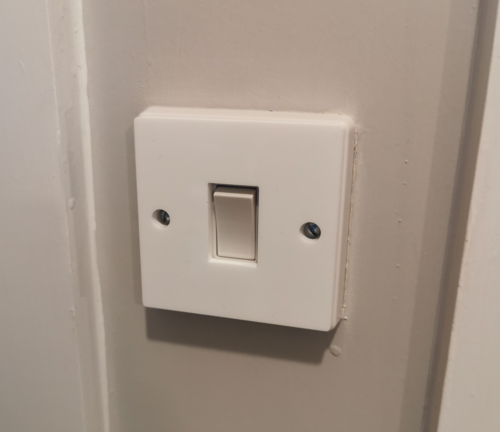
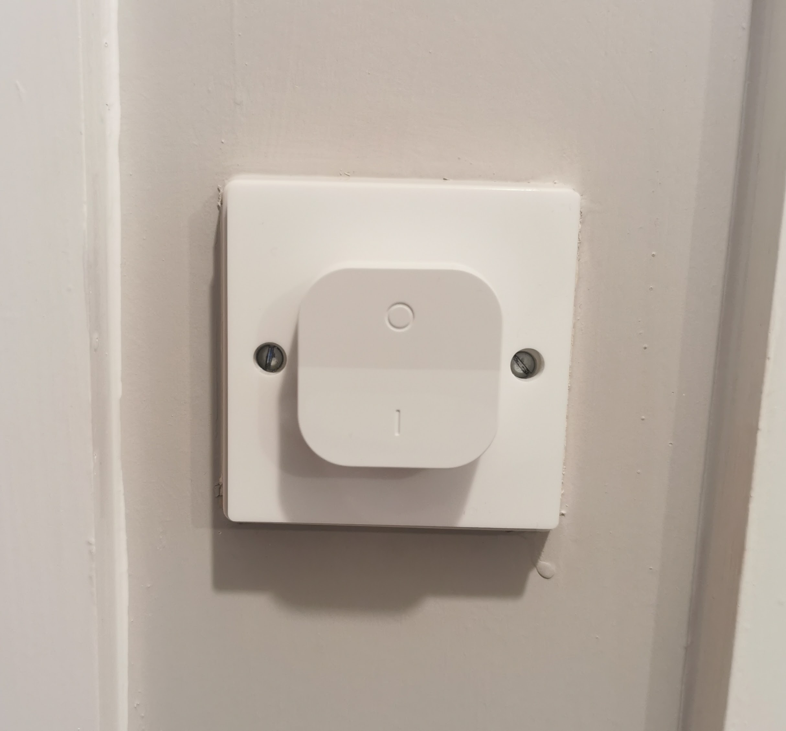
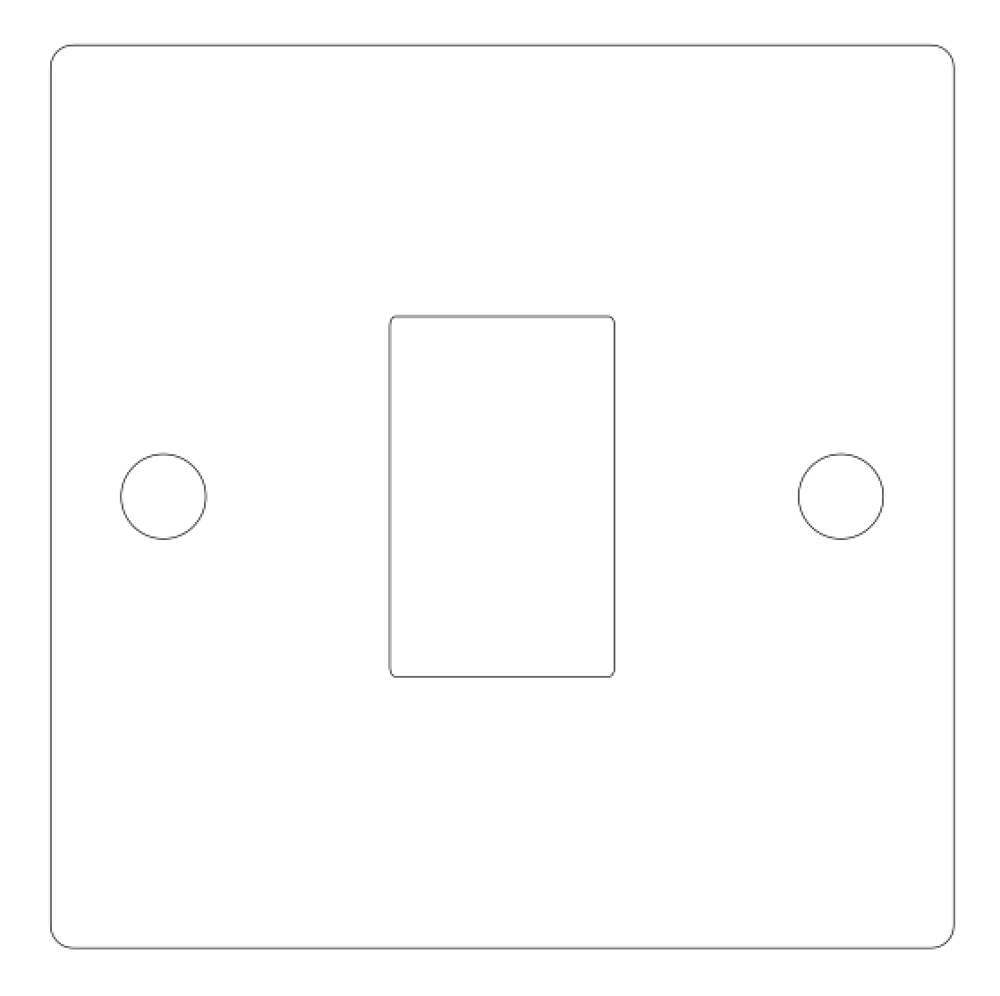

This is a spacer plate for a UK single gang light switch, to allow you to mount a smart switch over the existing switch without modifications.

The switch must be a traditional flat profile switch rather than a modern "Low Profile" or curve fronted switch. Something like a Crabtree Capital SP 1 Gang Switch is perfect.

**N.B.** I measured a handful of switches and the rocker protrudes <= 5mm from the face plate. 5mm acrylic was enough for my switches, but 6mm might be a better choice if you can find it.

## Images

Before affixing the spacer:  

After the spacer has been fixed:  

Completed:  

SVG:  

## Assembly

- Cut the mount out of ~5mm acrylic with a laser cutter.
- Mount over the existing switch. Use Blu Tack, double sided tape or similar to secure it.
- Mount Smart Switch to spacer

## Licence

This project is licensed under the [Creative Commons CC BY-NC-SA 4.0](https://creativecommons.org/licenses/by-nc-sa/4.0/) licence.

You are free to share and adapt the code as required, however you *must* give appropriate credit and indicate what changes have been made. You must also distribute your adaptation under the same license. Commercial use is prohibited.

## Acknowledgements

Thanks to the [London Hackspace](https://london.hackspace.org.uk/) for use of the Laser Cutter.
